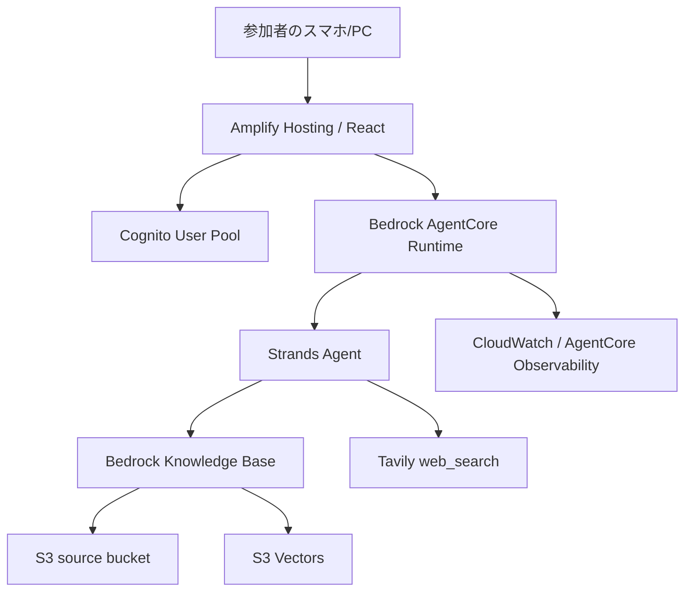

# AWSサミットエージェント（非公式）

AWS Summit Japan 2026 の参加者をサポートする非公式AIチャットアプリです。スマホから、セッション選び、会場での動き方、Expoの見どころ、周辺の飲食店などを相談できます。

- 公開アプリ： https://summit.minoruonda.com

このリポジトリは、Reactフロントエンド、Amplify Gen2、Cognito、Bedrock AgentCore Runtime、Strands Agents、Bedrock Knowledge Basesを組み合わせた実装例です。

## できること

- Cognitoでサインアップ、ログイン
- フロントエンドからAgentCore Runtimeを直接呼び出し
- Strands Agentsでツール利用とストリーミング応答
- Bedrock Knowledge Baseを使ったRAG回答
- Tavilyによる補助的なWeb検索
- `react-markdown` によるMarkdown表示
- Xで共有しやすいツイートリンクとOGPカード

## 全体設計



フロントエンドはVite + Reactです。認証はAmplify UI Authenticatorを使い、ログイン後にCognitoのトークンでAgentCore Runtimeを呼びます。

バックエンドはAmplify Gen2のcustom CDK stackで作っています。AgentCore RuntimeはPythonコンテナで、Strands AgentsのツールとしてKnowledge Base検索、Web検索、URL取得、現在時刻、イベント概要を持たせています。

Knowledge Baseは通常のBedrock Knowledge Basesです。ベクトルストアにS3 Vectorsを使い、階層型チャンキングとFoundation Modelベースのマルチモーダルパースを設定しています。

## ディレクトリ

```text
amplify/              Amplify Gen2とCDKのバックエンド定義
amplify/agent/        AgentCore RuntimeとStrands Agent
amplify/auth/         Cognito認証設定
amplify/knowledge-base/ Bedrock Knowledge BaseとS3 Vectors
src/                  Reactフロントエンド
public/               faviconやOGP画像
docs/                 公開してよい補足ドキュメント
knowledge-base/       KBデータ管理の説明
.local/               開発メモ、収集データ、スクショなどのローカル退避先
```

`.local/`、`data/`、`tmp/`、`knowledge-base/source/`、`knowledge-base/manifests/` はGit管理から外しています。作者が運用時に使うデータ、作業メモ、スクリーンショット、環境固有の出力をローカルで扱うための置き場です。

## セットアップ

Node.jsとAWS CLIを用意し、AWSへログインしてから依存関係を入れます。

```sh
npm install
aws sso login --profile <your-profile>
```

Tavilyを使う場合は、APIキーをAWS Secrets Managerに保存し、そのSecret ARNを環境変数で渡します。リポジトリにはAPIキーを入れません。

```sh
export AWS_PROFILE=<your-profile>
export AWS_REGION=us-east-1
export TAVILY_API_SECRET_ARN=arn:aws:secretsmanager:us-east-1:<account-id>:secret:<secret-name>
```

Amplify sandboxを作ります。

```sh
npm run sandbox:once -- --profile <your-profile> --identifier <your-name>
```

`amplify_outputs.json` が生成されたら、フロントエンドを起動できます。

```sh
npm run dev
```

## Knowledge Baseのデータ

作者のみのるんが実際に運用しているKnowledge Base用データは、このリポジトリには直接含めていません。アプリ本体とデータ投入の構成だけを公開し、利用する人が自分の用途に合わせてデータを用意できる形にしています。

投入するデータは `knowledge-base/source/` にMarkdownやPDFとして置きます。このディレクトリは `.gitignore` 済みなので、ローカルで自由に差し替えられます。

```text
knowledge-base/source/
  official/
  sessions/
  expo/
  community/
  raw-pdf/
```

Amplify outputsに出力されるS3 bucket名とprefixを確認し、データを同期してからBedrock Knowledge Baseのingestion jobを実行します。

```sh
aws s3 sync knowledge-base/source \
  s3://<source-bucket>/<source-prefix>/ \
  --profile <your-profile> \
  --region us-east-1 \
  --delete
```

## 環境変数

| 変数 | 用途 |
| --- | --- |
| `AWS_REGION` / `AWS_DEFAULT_REGION` | BedrockやAgentCoreを使うリージョン |
| `MODEL_ID` | Agentが使うBedrockモデル |
| `HTTP_SUMMARY_MODEL_ID` | URL本文要約に使うBedrockモデル |
| `SUMMIT_KB_ID` | 既存Knowledge Baseを使う場合のID |
| `TAVILY_API_SECRET_ARN` | Tavily APIキーを保存したSecrets Manager ARN |

## 注意

このアプリはイベント参加者向けの非公式ツールです。セッションや店舗の情報は変更される可能性があるため、回答では公式サイトや店舗ページでの最終確認を促すようにしています。

AWSリソースは利用量に応じて課金されます。公開運用する場合は、AWS Budgets、CloudWatch Alarm、ログ保持期間、レート制限を設定してください。

## ライセンス

MIT Licenseです。詳細は [LICENSE](./LICENSE) を参照してください。
